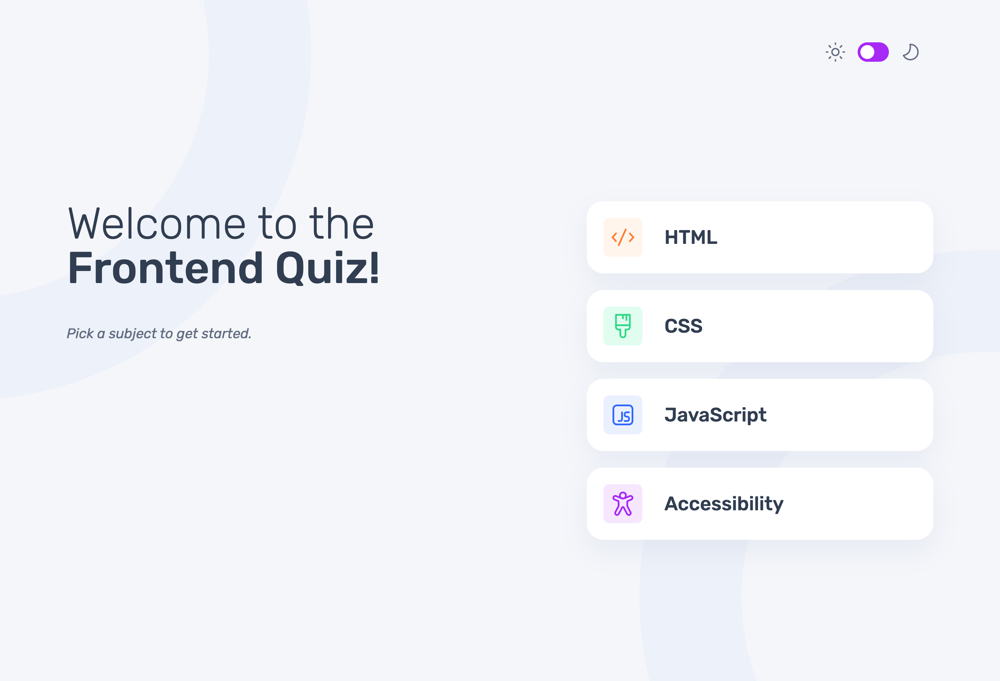

# Frontend Mentor - Frontend quiz app solution

This is a solution to the [Frontend quiz app challenge on Frontend Mentor](https://www.frontendmentor.io/challenges/frontend-quiz-app-BE7xkzXQnU). Frontend Mentor challenges help you improve your coding skills by building realistic projects. 

## Table of contents

- [Overview](#overview)
  - [The challenge](#the-challenge)
  - [Screenshot](#screenshot)
  - [Links](#links)
- [My process](#my-process)
  - [Built with](#built-with)
  - [What I learned](#what-i-learned)
  - [Continued development](#continued-development)
  - [Useful resources](#useful-resources)
- [Author](#author)
- [Acknowledgments](#acknowledgments)

**Note: Delete this note and update the table of contents based on what sections you keep.**

## Overview

### The challenge

Users should be able to:

- Select a quiz subject
- Select a single answer from each question from a choice of four
- See an error message when trying to submit an answer without making a selection
- See if they have made a correct or incorrect choice when they submit an answer
- Move on to the next question after seeing the question result
- See a completed state with the score after the final question
- Play again to choose another subject
- View the optimal layout for the interface depending on their device's screen size
- See hover and focus states for all interactive elements on the page
- Navigate the entire app only using their keyboard
- **Bonus**: Change the app's theme between light and dark

### Screenshot



### Links

- [Live Site](https://s2i61m97o.github.io/frontend-quiz-app)

## My process

### Built with

- Semantic HTML5 markup
- SASS
- Flexbox
- Mobile-first workflow
- [React](https://reactjs.org/) - JS library
  - React useState
  - React useEffect

### What I learned

This is my first time using React in a project. I have been doing the [Scrimba](https://scrimba.com/) course: [Learn React](https://scrimba.com/learn-react-c0e), which I recommend, I decided to start this project whilst still learning React and applying skills as I went.

I learnt about components in React, rendering different components as well as passing props to components. I also used state and passed state down components as it was needed at different levels. Majority of this I was confident enough with, as I had just done the Scrimba course and so it was more about solidifying and practising with knowledge gained.

My biggest learning point was about manipulating styles. At first I was accessing the DOM like you would in vanilla JavaScript (`document.querySelector(...)`), which is not the way to do it in React. I then learnt about `useRef` and so starting to implement that. But when using [Claude.ai](claude.ai) to explain how to use `useRef`, it suggested React state may be better for this job. I then managed to manipulate styles depending on the state of the 'correct answer' and the 'selected answer'. 
I used class names to figure to set styles, and rendered those class names depending on certain states.

```Javascript

  const optionBtns = quizData[quizTopic].questions[questionNum - 1].options.map(
    (option, index) => {
      return (
        <button
          key={index}
          className={setOptionsClassName(option)}
          type="radio"
          name="option"
          value={option}
          onClick={handleChange}
          disabled={answerSubmitted ? true : false}
        >
          <div className="optionChar">{answerOptions[index]}</div>
          {option}
          
        </button>
      );
    }
  );

```
I am proud that I figured out the 'how-to', once I realised - perhaps it should not have taken Claude.ai to tell me - that I could use state to do this. I `useRef` did become useful knowledge, using it to attach `scrollIntoView` to the error message in case screens did not have the height to show the message at the bottom of the page.


### Continued development

I will continue with using React within projects as well as developing my skills and knowledge to use more of what React has to offer. I will also look at CSS Animations, a possibly return to this project to add some to this quiz, such as a celebratory animation if 100% is achieved on the quiz.


### Useful resources

- This [Scrimba Learn React Course](https://scrimba.com/learn-react-c0e) is where I gained majority of my React knowledge. 
- This [w3schools how-to](https://www.w3schools/how/howto_css_switch.asp) is where I learnt how to create the switch for the light-dark theme. I created this [Codepen](https://codepen.io/s2i61m97o/pen/RNaQvEp) from it, styling the switch for what I needed for this project.
- This [w3schools React Form Tutorial](https://www.w3schools.com/react/react_forms_radio.asp) helped with using radio buttons as part of a form in React.


## Author

- Frontend Mentor - [@s2i61m97o](https://www.frontendmentor.io/profile/s2i61m97o)
